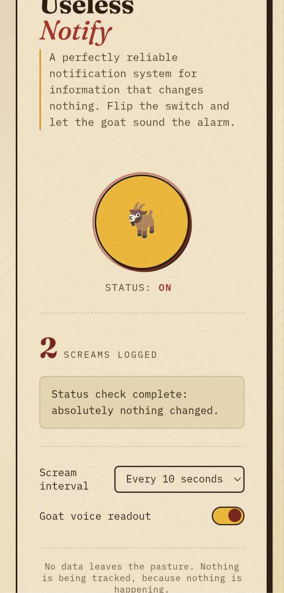
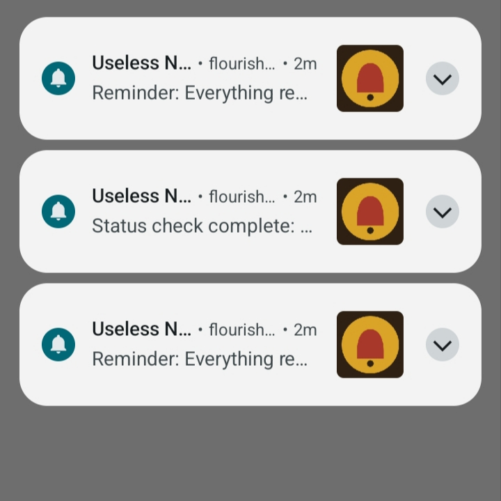
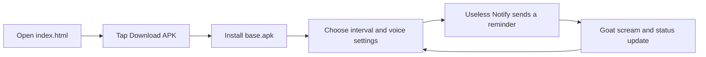

# Useless Notify

## Basic Details
## Team Member
- Member 1 : Sreehari M - Ahalia School Of Engenering And Technology
- Member 2 : Rithunand S - Ahalia School Of Engenering And Technology

### Project Description
Useless Notify is a perfectly reliable notification system for information that changes nothing. The Android app periodically sends intentionally pointless reminders and lets a goat scream on schedule, turning the absence of important news into a feature.

### The Problem (that doesn't exist)
People are constantly worried that nothing has changed. There is no practical way to receive regular confirmation that everything remains exactly as it was.

### The Solution (that nobody asked for)
Useless Notify provides a control panel for doing absolutely nothing: switch the system on or off, choose the scream interval, and enable or disable the goat voice readout. It reports that nothing changed with admirable consistency.

## Technical Details
### Technologies/Components Used
- HTML5 and CSS3 for the download page
- Inline SVG icons for the Android and download actions
- Web App Manifest for installable-app metadata
- Service worker for basic offline fallback behavior
- Android APK (`base.apk`) for the notification experience
- Local static hosting for development and distribution

### Implementation
The repository contains a lightweight static download page and the compiled Android artifact:

- `index.html` presents the APK download action and identifies the downloadable file.
- `manifest.json` defines the installable app name, theme, icons, and standalone display mode.
- `sw.js` activates immediately, claims clients, and returns a basic offline response when a fetch fails.
- `base.apk` is the Android application that produces the Useless Notify experience shown in the screenshots.

## Installation and Run

### Download the Android app
1. Serve this folder from a local or web server.
2. Open the page on an Android device.
3. Tap **Download APK** and install `base.apk`.

### Run the download page locally
From the project directory:

```bash
python3 -m http.server 8000
```

Open <http://localhost:8000> in a browser. A static server is recommended so the manifest and service worker are handled in a browser-like environment.

## Project Documentation

### Screenshots

*The notification icon: a deliberately over-serious bell inside the Useless Notify mark.*


*The app dashboard showing the enabled state, scream count, interval selector, goat voice toggle, and status message.*


*Example Android notifications generated by the app, including reminders that nothing has changed.*

### Workflow


The web page is only the distribution surface; notification scheduling and the goat experience are provided by the Android APK.

## Project Demo

### Video
No video link is included yet.

### Additional Demos
- APK download page: `index.html`
- Android build: `base.apk`

## Team Contributions
- Team lead: TBD
- Android app and notification behavior: TBD
- Download page and packaging: TBD

---
Made with ❤️ at TinkerHub Useless Projects 


